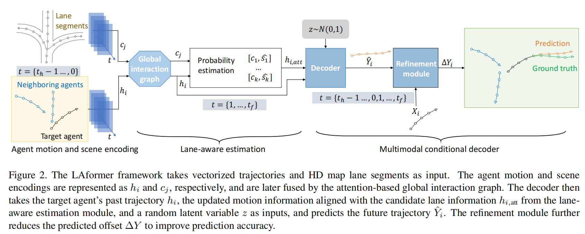

# LAformer: Trajectory Prediction for Autonomous Driving with Lane-Aware Scene Constraints

This repository contains the official implementation of LAformer: Trajectory Prediction for Autonomous Driving with Lane-Aware Scene Constraints




## Quick Start

Requires:

* Python ≥ 3.6
* PyTorch ≥ 1.6

### 1) Install Packages

``` bash
 pip3 install torch torchvision torchaudio --extra-index-url https://download.pytorch.org/whl/cu113
 pip3 install -r requirements.txt
```

### 2) Install Argoverse API
The latest version of Argoverse requires Python ≥ 3.7

If using Python 3.6, you can install Argoverse v1.0 

https://github.com/argoai/argoverse-api


### 3) Install Nuscenes
``` bash
 pip3 install nuscenes-devkit
```

1. Download the [nuScenes dataset](https://www.nuscenes.org/download). For this project we just need the following.
    - Metadata for the Trainval split (v1.0)
    - Map expansion pack (v1.3)

2. Organize the nuScenes root directory as follows
```plain
└── nuScenes/
    ├── maps/
    |   ├── basemaps/
    |   ├── expansion/
    |   ├── prediction/
    |   ├── 36092f0b03a857c6a3403e25b4b7aab3.png
    |   ├── 37819e65e09e5547b8a3ceaefba56bb2.png
    |   ├── 53992ee3023e5494b90c316c183be829.png
    |   └── 93406b464a165eaba6d9de76ca09f5da.png
    └── v1.0-trainval
        ├── attribute.json
        ├── calibrated_sensor.json
        ...
        └── visibility.json         
```


## Usages Argoverse 1

### 1) Train (First Stage)
Suppose the training data of Argoverse motion forecasting is at ```./train/data/```.
```bash
OUTPUT_DIR=checkpoints/models.laformer.1; \
GPU_NUM=8; \
python src/train.py --future_frame_num 30   --do_train --data_dir ./train/data/ \
--output_dir ${OUTPUT_DIR} --topk 2 --hidden_size 128 --train_all  --vector_size 32 \
--train_batch_size 128 --use_map  --num_train_epochs 10 --lane_loss_weight 10  --core_num 32 \
--subdivide_length 5    --use_centerline --distributed_training ${GPU_NUM} \
--other_params  semantic_lane direction step_lane_score enhance_global_graph  point_level-4-3
``` 
Add --reuse_temp_file  to skip re-listing the map file for the second time running or use --temp_file_dir ${path} to specify the pre-processed data path.

### 1) Train (Second Stage Motion Refinement)
Suppose the training data of Argoverse motion forecasting is at ```./train/data/```.
```bash
OUTPUT_DIR=checkpoints/models.laformer.s2.1; \
GPU_NUM=8; \
MODEL_PATH=checkpoints/models.laformer.1/model_save/model.10.bin; \
python src/train.py --future_frame_num 30   --do_train --data_dir ./train/data/ \
--output_dir ${OUTPUT_DIR}   --hidden_size 128   --topk 2 \
--vector_size 32 --train_batch_size 128 --use_map  --num_train_epochs 9 \
--lane_loss_weight 10  --core_num 32 --subdivide_length 5  --learning_rate 0.0003\
--train_all --use_centerline --distributed_training ${GPU_NUM}  \
--other_params  semantic_lane direction step_lane_score enhance_global_graph \
point_level-4-3  stage-two-train_recover=${MODEL_PATH} stage-two-epoch=9 stage_two
``` 


### 2) Evaluate
Suppose the validation data of Argoverse motion forecasting is at ```./val/data/```.

Example:
```bash
OUTPUT_DIR=checkpoints/models.laformer.s2.1; \
GPU_NUM=1; \
python src/eval.py  --future_frame_num 30 --eval_batch_size 128\
--output_dir ${OUTPUT_DIR} --hidden_size 128 --train_batch_size 128 \
--lane_loss_weight 10 --topk 2 --use_map  --vector_size 32 --model_recover_path  9 \
--core_num 16 --use_centerline --distributed_training ${GPU_NUM}\
--subdivide_length 5 --other_params semantic_lane direction step_lane_score enhance_global_graph \
point_level-4-3  stage-two-train_recover=${MODEL_PATH} stage-two-epoch=9 stage_two \
  --do_eval  --data_dir_for_val ./val/data/
 
 ```
 
## Usages NuScenes
1. Run the following script to extract pre-processed data. This speeds up training significantly.
```shell
python src/datascripts/dataloader_nuscenes.py --DATAROOT path/to/nuScenes/root/directory --STOREDIR path/to/directory/with/preprocessed/data 
```
### 1) Train (First Stage)
Suppose the processed training data of NuScenes is at ```checkpoints/models.laformer.nuscenes.1/temp_file```.
```bash
OUTPUT_DIR=checkpoints/models.laformer.nuscenes.1; \
GPU_NUM=8; \
python src/train.py --do_train --future_frame_num 12 --output_dir ${OUTPUT_DIR} \
--topk 2 --hidden_size 64 --train_batch_size 32 --num_train_epochs 50 \
--lane_loss_weight 0.9 --distributed_training ${GPU_NUM} --reuse_temp_file \
--other_params  semantic_lane direction step_lane_score enhance_global_graph \
point_level-4-3 nuscenes nuscenes_mode_num=5
``` 
Add --reuse_temp_file or use --temp_file_dir ${path} to specify the pre-processed data path.

### 1) Train (Second Stage Motion Refinement)
Suppose the processed training data of NuScenes is at ```checkpoints/models.laformer.nuscenes.1/temp_file```.
```bash
OUTPUT_DIR=checkpoints/models.laformer.nuscenes.1; \
GPU_NUM=8; \
MODEL_PATH=checkpoints/models.laformer.1/model_save/model.50.bin; \
python src/train.py --future_frame_num 12   --do_train --output_dir ${OUTPUT_DIR}\
--hidden_size 64   --topk 2 --train_batch_size 32  --num_train_epochs 50 \
--lane_loss_weight 0.9   --reuse_temp_file --distributed_training ${GPU_NUM}  \
--other_params  semantic_lane direction step_lane_score enhance_global_graph \
point_level-4-3  stage-two-train_recover=${MODEL_PATH} stage-two-epoch=50 stage_two \
nuscenes nuscenes_mode_num=5
``` 

To train a model with 10 modes, you can set nuscenes_mode_num=10, --topk 4, and --num_train_epochs 100, the other settings is the same as aforementioned command.

### 2) Evaluate
Suppose the processed test data of NuScenes is at ```checkpoints/models.laformer.nuscenes.1/temp_file```.

Example:
```bash
OUTPUT_DIR=checkpoints/models.laformer.nuscenes.1; \
GPU_NUM=1; \
MODEL_PATH=checkpoints/models.laformer.1/model_save/model.50.bin; \
python src/eval.py  --future_frame_num 12 --eval_batch_size 128 \
  --output_dir ${OUTPUT_DIR} --hidden_size 64 --train_batch_size 32 \
  --lane_loss_weight 0.9 --topk 2 --reuse_temp_file --model_recover_path  50 \
 --distributed_training ${GPU_NUM} --other_params step_lane_score  stage_two \
    semantic_lane direction enhance_global_graph subdivide new laneGCN \
  point_level-4-3 stage-two-train_recover=${MODEL_PATH} stage-two-epoch=50 \
nuscenes nuscenes_mode_num=5 --do_eval
```  
## Pretrained Models

We provide the pretrained LAformer in [checkpoints/](checkpoints). You can evaluate the pretrained models using the aforementioned evaluation command.

## Results

### Quantitative Results

For this repository, the expected performance on Argoverse 1.1 validation set is:

| Models | minADE | minFDE | MR |
| :--- | :---: | :---: | :---: |
|LAformer | 0.64 | 0.92 | 0.08 |

The expected performance on nuScenes Test set is:
| Models | minADE_5 | minFDE_5 | minADE_10 | minFDE_10 |
| :--- | :---: | :---: | :---: |:---: |
|LAformer | 1.19 | 2.31| 0.93|  1.50

### Qualitative Results


## Citation

If you found this repository useful, please consider citing our work:

```
@article{liu2023laformer,
  title={LAformer: Trajectory Prediction for Autonomous Driving with Lane-Aware Scene Constraints},
  author={Liu, Mengmeng and Cheng, Hao and Chen, Lin and Broszio, Hellward and Li, Jiangtao and Zhao, Runjiang and Sester, Monika and Yang, Michael Ying},
  journal={arXiv preprint arXiv:2302.13933},
  year={2023}
}
```

## License

This repository is licensed under [Apache 2.0](LICENSE).

## **Awesome Related Repos**

* https://github.com/Tsinghua-MARS-Lab/DenseTNT
* https://github.com/ZikangZhou/HiVT
